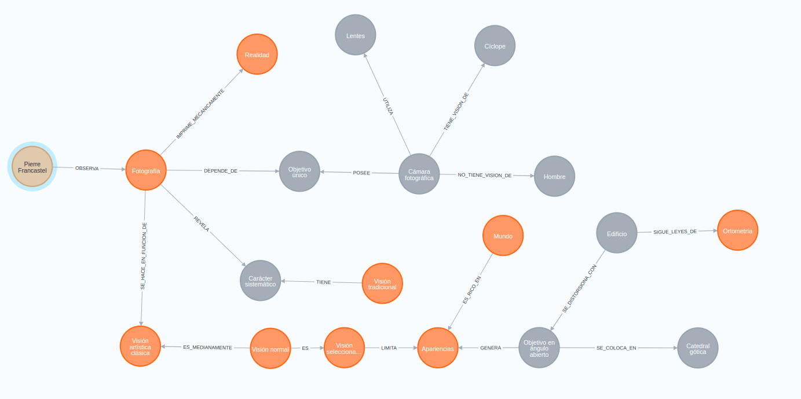
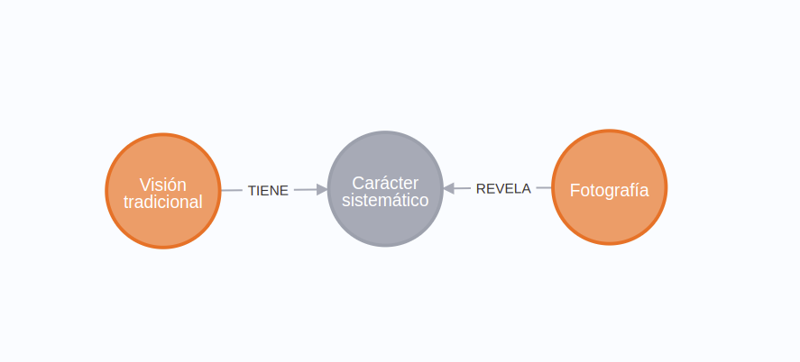
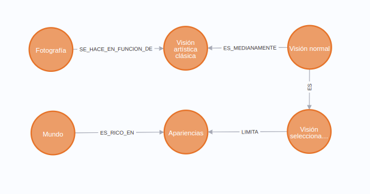

### De la lectura a la inferencia: grafos de conocimiento y validación del sentido

En un post para linkedin (puede verlo [aquí](https://www.linkedin.com/posts/sandro-orme%C3%B1o-3826196b_leer-un-texto-te%C3%B3rico-suele-implicar-un-gesto-activity-7422308092513701888-v4Lv?utm_source=share&utm_medium=member_desktop&rcm=ACoAAA7dB9IB6wSbsTlokEc42DYAPyOjOcXhY1Y)) describí la necesidad de complementar el proceso tradicional de adquisición de conocimiento, basado principalmente en la lectura, con la elaboración explícita de un grafo de conocimiento. Este proceso incrementa de manera significativa nuestra capacidad de entendimiento, al tiempo que favorece la estructuración y organización de la información.

El presente git tiene una naturaleza técnica y tiene como objetivo mostrar cómo generar un grafo de conocimiento a partir del texto de Pierre Francastel (citado en el post anterior). El lector es libre de utilizar cualquier herramienta para la construcción del grafo, incluida una herramienta experimental que he diseñado para la extracción de entidades y relaciones a partir de texto (accesible en este [enlace](https://d1f6146a-21cf-4c99-81ad-fb2587138195-00-1kmvvdbnyst77.riker.replit.dev/)). Esta herramienta puede operar utilizando distintos modelos de lenguaje de gran tamaño (LLMs) o, y esta es la parte más interesante, puede apoyarse directamente en el criterio humano para la elaboración del grafo. Esta flexibilidad la convierte, a mi juicio, en la mejor opción.

Un lector que recién se inicia en el uso de grafos de conocimiento puede adoptar un procedimiento mixto, combinando LLMs con intuición y juicio humano. Además, dejo a disposición un mapa conceptual que puede servir como apoyo durante el proceso de modelado.



Los usuarios de _Neo4j_ disponen de dos caminos equivalentes para construir el grafo. Por un lado, pueden cargar directamente el archivo dump (accesible desde este [enlace](https://github.com/sandroormeno/My_Neo4j_DB/blob/main/dumps/Francastel.dump)), que contiene la totalidad del grafo modelado (18 entidades y 19 relaciones). Por otro, pueden generar exactamente el mismo grafo ejecutando manualmente las sentencias correspondientes en Cypher. Ambos procedimientos conducen al mismo resultado y quedan a elección del lector según su preferencia o nivel de familiaridad con la herramienta.

``` cypher
// Crear entidades principales
CREATE (francastel:Persona {nombre: "Pierre Francastel"})
CREATE (fotografia:Concepto {nombre: "Fotografía"})
CREATE (vision_tradicional:Concepto {nombre: "Visión tradicional"})
CREATE (vision_artistica:Concepto {nombre: "Visión artística clásica"})
CREATE (vision_normal:Concepto {nombre: "Visión normal"})
CREATE (vision_seleccionada:Concepto {nombre: "Visión seleccionada"})
CREATE (camara:Objeto {nombre: "Cámara fotográfica"})
CREATE (ciclope:Referencia {nombre: "Cíclope"})
CREATE (hombre:Referencia {nombre: "Hombre"})
CREATE (objetivo_unico:ComponenteTecnico {nombre: "Objetivo único"})
CREATE (lentes:ComponenteTecnico {nombre: "Lentes"})
CREATE (ortometria:Concepto {nombre: "Ortometría"})
CREATE (objetivo_angular:ComponenteTecnico {nombre: "Objetivo en ángulo abierto"})
CREATE (catedral_gotica:Objeto {nombre: "Catedral gótica"})
CREATE (edificio:Objeto {nombre: "Edificio"})
CREATE (mundo:Concepto {nombre: "Mundo"})
CREATE (apariencias:Concepto {nombre: "Apariencias"})
CREATE (realidad:Concepto {nombre: "Realidad"})
CREATE (caracter_sistematico:Propiedad {nombre: "Carácter sistemático"})

// Crear relaciones
CREATE (francastel)-[:OBSERVA]->(fotografia)
CREATE (fotografia)-[:REVELA]->(caracter_sistematico)
CREATE (fotografia)-[:IMPRIME_MECANICAMENTE]->(realidad)
CREATE (fotografia)-[:SE_HACE_EN_FUNCION_DE]->(vision_artistica)
CREATE (camara)-[:POSEE]->(objetivo_unico)
CREATE (camara)-[:UTILIZA]->(lentes)
CREATE (camara)-[:TIENE_VISION_DE]->(ciclope)
CREATE (camara)-[:NO_TIENE_VISION_DE]->(hombre)
CREATE (vision_tradicional)-[:TIENE]->(caracter_sistematico)
CREATE (vision_normal)-[:ES]->(vision_seleccionada)
CREATE (vision_normal)-[:ES_MEDIANAMENTE]->(vision_artistica)
CREATE (edificio)-[:SE_DISTORSIONA_CON]->(objetivo_angular)
CREATE (edificio)-[:SIGUE_LEYES_DE]->(ortometria)
CREATE (objetivo_angular)-[:SE_COLOCA_EN]->(catedral_gotica)
CREATE (objetivo_angular)-[:GENERA]->(apariencias)
CREATE (mundo)-[:ES_RICO_EN]->(apariencias)
CREATE (vision_seleccionada)-[:LIMITA]->(apariencias)
CREATE (fotografia)-[:DEPENDE_DE]->(objetivo_unico)

RETURN *


```

No hay excusas para no experimentar con el grafo: todo está servido.

Ahora bien, _¿qué podemos hacer con este grafo?_ En primera instancia, razonar con él. Es muy probable que el lector se plantee una pregunta que no se desprende de manera inmediata de la lectura lineal del texto, por ejemplo:

¿Qué concepto o idea revela la fotografía sobre la visión tradicional?

La respuesta está presente en el texto original:

“la fotografía … ha hecho aparecer no el carácter real de la visión tradicional sino, por el contrario, su carácter sistemático”.

En el grafo, esta respuesta resulta claramente visible al observar la relación entre los nodos Fotografía y Visión tradicional:




El concepto carácter sistemático aparece explícitamente entre ambos nodos. El grafo puede leerse incluso de forma declarativa:

la visión tradicional TIENE carácter sistemático, y la fotografía REVELA ese carácter sistemático.

Pero surge una pregunta técnica relevante: ¿cómo llegamos a ese subgrafo?, ¿cómo hacemos visible esa relación dentro del grafo completo?, ¿cómo focalizamos la exploración en esa parte específica del conocimiento?
El siguiente código en Cypher permite hacerlo:

```
MATCH path = ({nombre: "Fotografía"})-[*]-({nombre: "Visión tradicional"})
RETURN nodes(path), relationships(path)

```
Este código devuelve todas las rutas (paths) en las que coinciden los nodos con nombre Fotografía y Visión tradicional. 
Los nodos se representan entre paréntesis, mientras que las relaciones se indican entre corchetes. El asterisco (*) señala que no se impone un límite en la cantidad de relaciones intermedias: no importa cuántos saltos existan entre ambos nodos.

Sin embargo, el lector puede desear una respuesta más puntual, un hecho explícito que el grafo representa. Para ello, puede utilizar el siguiente patrón:

```
MATCH ({nombre: "Fotografía"})-[*]-(concepto)-[*]-({nombre: "Visión tradicional"})
RETURN concepto.nombre
```

En este caso, el patrón incluye un nodo intermedio denominado concepto, que actúa como alias para el elemento que se desea identificar. Esta formulación corresponde a una reestructuración de la pregunta original:

¿Qué concepto hay entre Fotografía y Visión tradicional?

El resultado devuelto es el nombre del concepto: carácter sistemático

Pero un grafo de conocimiento va más allá de la mera estructuración de información. Permite inferir nuevo conocimiento o deducir relaciones que no son evidentes en la narrativa original, y que el texto puede no formular de manera explícita. Por ejemplo:

¿Qué concepción de la visión fundamenta que las fotografías limiten las apariencias del mundo?

Esta pregunta puede resultar incluso controvertida, pero la respuesta sugerida por el grafo es clara: la visión artística clásica LIMITA las apariencias del mundo.



El grafo permite inferir esta relación a través de la siguiente cadena conceptual:
1. La fotografía se hace en función de la *visión artística clásica*.
2. Esa visión artística clásica coincide, en gran medida, con la *visión normal*.
3. La visión normal es una *visión seleccionada*.
4. La visión seleccionada *limita las apariencias* del mundo.

Esta inferencia revela que la raíz de nuestra limitación perceptual se encuentra en las convenciones de la visión artística clásica, una conclusión que emerge de la estructura relacional del grafo, pero que no está formulada directamente en el texto de Francastel.

Antes de que el lector “grite al cielo”, es importante aclarar que esta limitación, aparentemente negativa, es precisamente lo que hace atractiva a la fotografía. Si la visión artística es seleccionada y limita las apariencias del mundo —y dado que el mundo es rico en apariencias—, resulta lógico deducir que existen múltiples maneras de representar esa riqueza inagotable. De ahí que dos fotografías de un mismo lugar, tomadas por fotógrafos distintos, nunca sean iguales.

El siguiente código representa esta relación compleja:

```
MATCH path = ({nombre: "Fotografía"})-[*]-({nombre: "Mundo"})
RETURN nodes(path), relationships(path)
```
Este patrón recorre todas las rutas existentes entre los nodos Fotografía y Mundo, haciendo visible la red conceptual que los conecta.

El grafo no “miente”: permite representar relaciones entre conceptos que, a primera vista, podrían parecer inconexos, revelando más conocimiento del que se obtiene mediante la lectura lineal. En este sentido, el grafo de conocimiento no reemplaza al texto, sino que lo complementa, lo expande y lo hace operable desde el razonamiento estructural.

